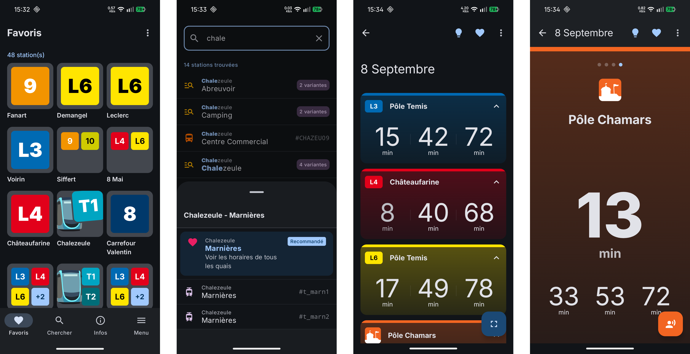
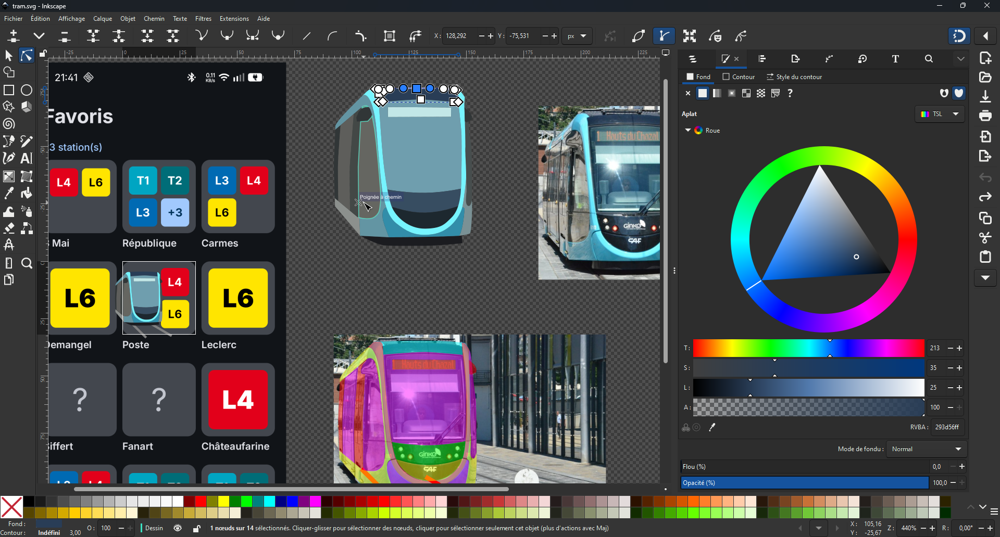

# SuperBus

Superbus (temporary name) is a mobile app aiming to be a better alternative to the "Ginko Mobilités" app. It is an application that provides real-time waiting times for bus and tram services.

[](./wiki/preview.png)

**[WARNING] This project still under development and many bugs aren't resolved. As this is a Proof of Concept project, the final result may be entierely different.**

## Features
- ⏲️ **Display waiting times**:
    - 🔍 with bigger font size (easily readable)
    - ↕️ full screen view (swipe cards)
    - 🖼️ support landscape view, or tablets
    - 💡 feature to keep the screen on
    - 🌙 dark mode support
- 📣 **Text-to-speech countdown**: announcement of waiting times (inspired by the [PANAM/SIEL screens of the Paris metro](https://youtu.be/M3j0xNkYBy0?si=6MJ926puqFzxaYgx&t=6))
    - 1️⃣ just with one transit line
    - *️⃣ or for several lines simultaneously (with auto-swiping cards in full screen mode)
    - 💤 disabled countdown in background
- ❤️ **Favorites with preview**: favorites pages with an overview of bus/tram lines
    - 🛠️ editable grid : wobbly tiles like iOS
    - ✏️ rename favorites items

## Incoming features

Here is a list of features I would like to add:

- Info trafic
- Settings page
- Tabbed view and/or Split view
- History support + clear history + private browsing
- i18n: English, Spanish
- Crowd level (affluence) on buses/trams
- Display vehicule infos (air conditioning, accessible ramp, USB ports, etc.)
- Allow run countdown text-to-speech in background
- Backup favorites stations : import/export data
- Support for Ginko Vélocité, Mobigo, SNCF, Citiz
- Map view + detection of nearby stations

[](./wiki/sketches.png)

Some drawings and vectorial images was made with Inkscape.

[](./wiki/inkscape.png)

## Build this app

### Environment

- **Android Studio** : (works fine with v.2025.3.3, may work with older versions)
- **Java** : 11

### Variables

This project need an API key to interact with Ginko API.
You have to [ask Ginko](https://api.ginko.voyage/#prez) in order to receive your key from this page. You can get a temporary key if you don't want to ask.
Then, edit `local.properties` to add this following line :
```ini
apikey.ginko_mobilite=PUT_YOUR_GINKO_API_KEY_RIGHT_THERE
```